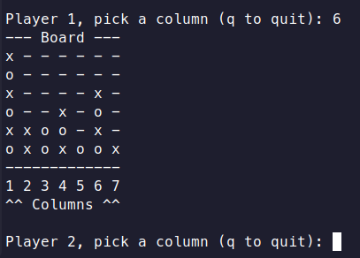
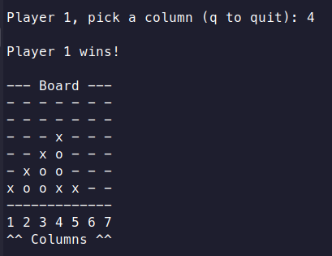

# connect4_rs
Connect 4 game written in Rust
### Overview
This was a practice game for me to learn basic Rust syntax and structure. It is a fully functional terminal-based connect 4 game for 2 players.
### Future
I may add a graphical implementation in the future to learn Rust graphics libraries
### Screenshots

